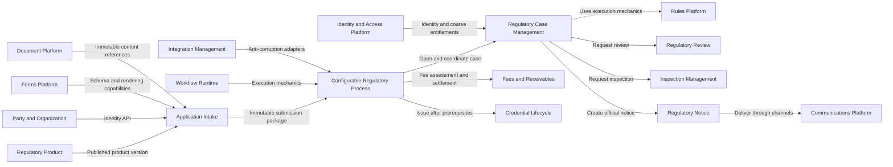
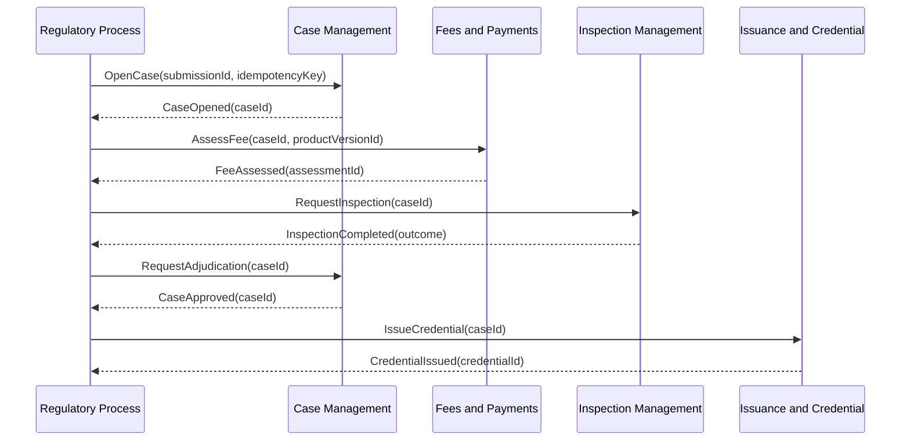

# Domain Architecture

## Design position

The Regulatory Platform should provide reusable domain capabilities rather than a universal
workflow. Customer and
jurisdiction workflows remain tailored orchestration over bounded contexts that own business
behavior and invariants.

## Initial context map



## Definition versus instance ownership

| Definition or instance | Owner |
|---|---|
| Regulatory product definition and version | Regulatory Product |
| Intake questionnaire definition associated with a product version | Application Intake |
| Applicant draft and submitted values | Application Intake |
| Case extension schema | Regulatory Case Management |
| Case extension values | Regulatory Case Management |
| Regulatory process definition and process state | Configurable Regulatory Process |

The contexts may share identifiers and published contracts, but not writable entities.

## Forms relationship

Application Intake owns the form's business meaning:

- which questions are asked for a product and jurisdiction;
- how answers contribute to completeness;
- who may answer or amend them;
- which questionnaire version a draft uses;
- the immutable answer snapshot included in a submission.
- traceability from each submitted answer or evidence item to the product requirement it satisfies.

The Forms Platform owns reusable technical mechanisms:

- typed schema primitives;
- schema authoring tools;
- rendering;
- accessibility;
- layout and conditional presentation;
- structural field validation.

This is a platform dependency, not a transfer of domain ownership. Application Intake is not allowed
to delegate regulatory completeness or submission invariants to the generic Forms Platform.

### Statutory forms and applicant questionnaires

Regulatory Product owns official information requirements and any legally prescribed form identity,
version, jurisdiction, and effective period. Application Intake owns the questionnaire presented to
the applicant and maps questionnaire fields back to those requirements.

This permits a better applicant experience without losing regulatory traceability:

- one answer may satisfy multiple requirements;
- a questionnaire may combine multiple statutory artifacts;
- conditional questions may be progressively disclosed;
- every submitted value still records the requirement and version it satisfies.

## Decisioning and Rules Platform

Decisioning is a conceptual grouping, not a presumed bounded context. Policies
remain with the business capability that owns their language and consequences:

| Decision | Candidate owner |
|---|---|
| Product applicability and information requirements | Regulatory Product |
| Submission completeness | Application Intake |
| Case acceptance, routing prerequisites, and final adjudication | Regulatory Case Management |
| Fee assessment | Fees and Payments |
| Inspection outcome | Inspection Management |
| Credential issuance eligibility | Issuance and Credential |

These contexts may compile or submit typed policy specifications to a shared Rules Platform. The
platform provides expression evaluation, version storage, simulation, and execution traces. It does
not provide generic domain APIs such as `RunRule(ruleId, facts)` to workflows. Workflows invoke
domain operations such as `AssessFee` or `DetermineIssuanceEligibility`.

A dedicated Decisioning bounded context should be introduced only if domain discovery identifies a
cohesive adjudication language, common evidence model, unified policy lifecycle, clear ownership,
and independently valuable capabilities across multiple regulatory products.

## Identity and domain authority

The Identity and Access Platform authenticates principals, integrates with customer identity
providers, and issues tenant membership and coarse entitlements. It does not decide regulatory
authority.

Each bounded context interprets the actor's identity and entitlements against domain state:

```text
IAM question:
  Is this authenticated principal a case reviewer for this tenant?

Case Management question:
  May this reviewer approve this case for this jurisdiction and product,
  given delegation limits, case risk, prior participation, and separation of duty?
```

This avoids both extremes:

- duplicating authentication and technical permission systems per customer;
- encoding regulatory decisions in a global RBAC table with no domain context.

## Configurable Regulatory Process

Configurable Regulatory Process is a bounded context because workflow definitions, process instances,
correlation, timers, escalation, retries, and compensation form a cohesive model with customer-
specific language and lifecycle.



### Consistency model

There is no transaction spanning participating contexts. A step completes when the receiving
context commits its own state and publishes an outcome reliably. The process manager then advances
the process.

| Outcome | Orchestration response |
|---|---|
| Temporary delivery or infrastructure failure | Retry with bounded backoff and the same idempotency key |
| Domain rejection | Follow an explicit rejection, remediation, or terminal process path |
| Human task overdue | Escalate, notify, or reassign according to process policy |
| Irreversible action completed before later failure | Invoke an explicit business compensation where one exists |
| Duplicate message | Deduplicate through receiver inbox/correlation state |

Workflow definitions may reference public commands and events only. They may not read another
context's database, manipulate internal statuses, or invoke generic rules by identifier.

The bounded context uses a Workflow Runtime for durable execution. Engine-specific concepts,
deployment descriptors, and worker APIs are encapsulated behind the process context so that domain
contracts do not depend on a particular orchestration product.

## Party and Organization

Party and Organization owns current identity and relationship data:

- people and organizations;
- contact points and addresses;
- representatives and delegated relationships;
- identifiers and verification status.

Mutable drafts may reference `PartyId`, but legally significant transitions capture immutable
snapshots. Updating a party profile never rewrites an earlier submission, case record, notice, or
credential. Material changes enter the relevant domain through an amendment or explicit business
process.

## Review and Inspection

Regulatory Review and Inspection Management are separate contexts.

| Regulatory Review | Inspection Management |
|---|---|
| Desk-based evidence evaluation | Scheduled field or remote verification |
| Reviewer assignment and queue | Inspector assignment, route, date, and location |
| Review findings and recommendation | Checklist observations, samples, violations, and outcome |
| Document-centric | Field-evidence-centric |

They may consume shared checklist and document infrastructure. They do not share aggregates or
collapse into a generic task model.

## Evidence and documents

Domain contexts own why a document matters, who supplied it, what requirement it satisfies, and
whether it is admissible. The Document Platform owns immutable bytes, versions, malware scanning,
encryption, retention execution, and retrieval.

An `EvidenceReference` includes the immutable document version and the domain classification. A
mutable file URL or shared document row is not a valid evidentiary contract.

## Regulatory notices

Regulatory Notice owns legally significant communication:

- notice type and governing authority;
- recipient snapshot;
- required content and attachments;
- service deadline and acceptable channels;
- delivery attempts and proof of service.

The Communications Platform delivers email, SMS, print, and other channels. A successful provider
API response is delivery telemetry; the Notice context determines whether legal service requirements
were satisfied.

## Credential lifecycle

Credential Lifecycle owns the granted regulatory right after approval: issuance, effective period,
standing, endorsements, conditions, suspension, revocation, expiration, and replacement.

Renewal is modeled as a new regulated request referencing the existing credential. This allows the
new submission to use current product and policy versions while preserving the original grant.

## Integration boundary

Integration Management provides connector lifecycle, credentials, monitoring, mapping tooling, and
external correlation. Translation remains context-specific through anti-corruption adapters. The
architecture deliberately avoids one enterprise canonical model spanning ERP, payments, GIS,
identity, documents, and customer-specific vendor semantics.

## Reporting and search

Cross-context reporting and search use event-fed projections. These read models may denormalize data
for operational dashboards, statutory reporting, support, and search, but they are not systems of
record and cannot be used to update domain state.

## Tenant and jurisdiction scope

Tenant/customer and jurisdiction are different dimensions:

- tenant scope controls deployment, branding, identity federation, enabled capabilities, and local
  configuration;
- jurisdiction scope controls regulatory products, policy applicability, effective dates, authority,
  and legal requirements.

Every public contract carries explicit tenant and jurisdiction context where applicable. Customer
branching in domain code is prohibited.

## Deployment strategy

Bounded contexts begin as modules in the existing stack with module-owned persistence, explicit
contracts, and architecture tests that prohibit cross-module database access. Independent services
are extracted only when justified by scale, isolation, availability, security, team ownership, or
release cadence.

## Metadata reference model

```text
ExtensionDefinition
  - DefinitionId
  - Namespace
  - Context
  - Name
  - DataType
  - Cardinality
  - Constraints
  - Applicability
  - SecurityClassification
  - SearchPolicy
  - RetentionPolicy
  - Version
  - LifecycleState
  - EffectivePeriod

ExtensionValue
  - DefinitionId
  - DefinitionVersion
  - OwnerAggregateId
  - TypedValue
  - RecordedAt
  - RecordedBy
```

This is a conceptual shape, not a mandate for one physical table or shared runtime component.

## Metadata governance test

A proposed extension is accepted as metadata only when all answers are `yes`:

1. Is it additional data or declarative policy rather than new domain behavior?
2. Can the owning bounded context validate it without executing arbitrary customer code?
3. Can it be versioned without changing the meaning of historical records?
4. Are its authorization, privacy, retention, and audit requirements declared?
5. Can downstream consumers ignore an unknown extension safely?

Otherwise, route the change to domain-model or extension-point review.
