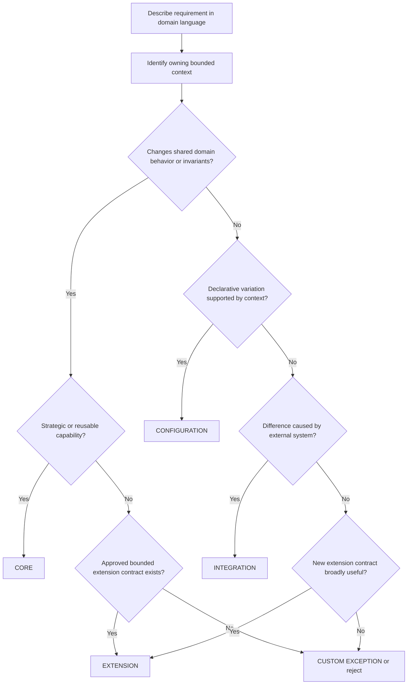

# Customization Governance Framework

## Objective

Replace unmanaged customer code with explicit variability mechanisms that preserve domain integrity,
upgradeability, security, and delivery speed.

The governance model must be embedded in product intake, design, implementation, CI/CD, and
production telemetry. A periodic architecture board reviewing every change would become a bottleneck
and recreate centralized decision dependency.

## Variability taxonomy

| Classification | Definition | Owner | Approval path | Lifecycle |
|---|---|---|---|---|
| Core | Reusable domain capability that belongs in the shared product model | Bounded-context owner | Product and context roadmap | Supported and versioned |
| Configuration | Declarative variation anticipated by the owning context | Customer/product configuration owner | Automated validation; no architecture board | Versioned and upgrade-tested |
| Extension | Behavior added through an approved, bounded contract | Context owner plus platform architecture | Lightweight design review | Versioned contract, owner, compatibility tests |
| Integration | Translation between a domain contract and an external system | Integration owner and consuming context | Adapter review plus security review | Independently deployable and observable |
| Custom exception | Customer-specific code outside approved mechanisms | Exception authority | Time-bounded executive approval | Mandatory expiry and convergence plan |

`Custom` is not a normal solution category. It is a business exception with visible carrying cost.

## Classification principles

### Core

Choose Core when the requirement:

- expresses a domain capability the Regulatory Platform intends to support strategically;
- is likely to recur across customers, jurisdictions, or product lines;
- changes domain language, invariants, or lifecycle;
- benefits from one supported implementation;
- cannot be safely represented by existing configuration or extension contracts.

Core does not mean every customer must enable or use the capability.

### Configuration

Choose Configuration when:

- the domain behavior is already understood by the owning context;
- variation is declarative and bounded;
- the schema can be typed and validated before publication;
- historical versions can remain interpretable;
- no arbitrary code execution is required.

Examples include product requirements, questionnaire composition, process sequencing, effective
dates, fee schedules, approved policy expressions, and context-owned metadata.

### Extension

Choose Extension when:

- behavior is genuinely exceptional but fits a stable, explicit hook;
- the extension cannot access internal tables or aggregates;
- inputs, outputs, failure modes, authorization, and resource limits are defined;
- compatibility and contract tests can run independently;
- the extension has an owner and operational telemetry.

Extensions are isolated behind domain contracts. They are not scripts embedded in metadata or
tenant-specific branches inside shared code.

### Integration

Choose Integration when the variation exists because an external system has a different protocol,
data model, or operating behavior.

The adapter:

- translates through an anti-corruption layer;
- never makes the external vendor model the platform domain model;
- uses idempotency, timeout, retry, and reconciliation;
- emits domain-meaningful outcomes;
- is independently observable and replaceable.

### Custom exception

Use only when all are true:

- a contractual, regulatory, or critical operational deadline cannot be met through an approved
  mechanism;
- the business value and delay cost justify the carrying cost;
- isolation prevents contamination of the shared model;
- an accountable sponsor accepts the upgrade and support cost;
- an expiry date and convergence backlog item exist.

## Decision flow



## Required decision record

Every non-trivial variation records:

- customer, jurisdiction, and regulatory driver;
- owning bounded context;
- classification and rationale;
- alternatives considered;
- affected contracts and data;
- security, privacy, retention, and audit impact;
- compatibility and migration approach;
- test strategy and observability;
- owner and support model;
- expiry and convergence plan for exceptions.

Standard configuration generated through approved tooling does not require an individual ADR. The
configuration definition, validation result, version, approver, and publication audit provide the
decision artifact.

## Decision ownership

| Decision | Accountable owner | Required consultation |
|---|---|---|
| Product capability priority | Product leadership | Context owner, customer delivery |
| Bounded-context model and invariants | Context owner | Domain experts, platform architect |
| Cross-context contract | Participating context owners | Platform architect, security where applicable |
| Configuration publication | Customer/product configuration owner | Domain approver |
| New extension point | Context owner | Platform architect, security, SRE |
| External adapter | Integration owner | Consuming context, security, SRE |
| Custom exception | Engineering/product executive sponsor | Platform architect, context owner, support |
| Standard and policy | Architecture council | Engineering leads, platform engineering |

The architecture council establishes standards and resolves cross-context disputes. It does not
approve routine implementation within an accepted context boundary.

## Approval workflow

| Path | Expected handling |
|---|---|
| Existing configuration mechanism | Self-service authoring, automated validation, domain approval, publish |
| Existing extension contract | Contract tests, owner approval, security/SRE checks where relevant |
| Shared-core enhancement | Context discovery, ADR, roadmap prioritization, backward-compatible release |
| New cross-context contract | Joint design by context owners, compatibility policy, consumer-driven tests |
| Integration adapter | Adapter design, threat model, resilience and reconciliation tests |
| Custom exception | Written business case, carrying-cost estimate, sponsor, expiry, isolation, convergence plan |

Urgency changes prioritization, not classification.

## New demand during migration

The tracer does not pause all other delivery. New customer and product requirements continue to
arrive while shared-core capabilities are being built. Categorization is used to route that demand
without automatically waiting for the tracer or creating another uncontrolled fork.

### Routing rule

After classification, ask these questions in order:

| Question | If yes | If no |
|---|---|---|
| Can the current shared product support it safely? | Implement now through the existing shared mechanism | Continue |
| Can it wait for the relevant shared capability or tracer? | Add to the platform backlog and set customer expectation | Continue |
| Is it strategically reusable and urgent? | Build the target-shaped shared capability now, even if outside the selected tracer | Continue |
| Is it contractually, regulatorily, or operationally urgent with no shared path? | Approve a temporary custom exception | Defer, reject, or re-scope |

The default is neither "wait indefinitely" nor "fork the customer." The default is explicit routing
based on supportability, urgency, reuse, and convergence cost.

### Category-specific handling before the shared path exists

| Classification | Preferred handling | If the mechanism does not exist yet |
|---|---|---|
| Configuration | Implement through current shared configuration | Add to configuration capability backlog, or use a time-boxed exception if urgent |
| Extension | Implement through an approved extension point | Build the extension point if reusable and urgent; otherwise time-boxed exception |
| Integration | Build or configure an adapter | Keep the adapter target-shaped with an anti-corruption boundary |
| Core | Add to shared product roadmap or build now if urgent and reusable | Avoid hiding new domain behavior in workflow/configuration |
| Custom exception | Use only when delivery cannot wait and no safe shared mechanism exists | Isolate, cost, expire, and create convergence backlog item |

### Examples

| Requirement during migration | Classification | If needed before the tracer ships | Convergence path |
|---|---|---|---|
| Customer needs an extra local ownership disclosure field | Configuration | If current forms support metadata, implement as config; otherwise isolated temporary field/config | Move into Product/Intake typed metadata |
| Customer has a different review sequence | Configuration | If legacy workflow can parameterize it, configure; otherwise isolated process exception | Move into Configurable Regulatory Process definition |
| Customer requires a proprietary risk score | Extension | Build through an existing scoring hook; if absent and urgent, isolated adapter/extension | Promote to approved scoring extension contract |
| Customer uses a different ERP | Integration | Build anti-corruption adapter around current domain contract | Keep adapter and remap to future Integration Management standard |
| Regulator introduces a new suspension lifecycle | Core | If urgent and broadly reusable, build as shared Credential Lifecycle work | Make it part of core domain model, not tenant branch |
| Customer deadline forces a one-off case status | Custom exception | Implement in isolated legacy path with tests, owner, expiry, and sponsor | Remove or replace with Case/Process domain capability |

### Temporary implementation standard

When a custom exception is unavoidable, implement it in the most target-shaped form possible:

- isolate it from shared domain code;
- name the future convergence mechanism;
- add characterization and regression tests;
- avoid tenant checks inside reusable modules;
- avoid direct cross-context database writes;
- record owner, sponsor, cost, expiry, and convergence target;
- make release and support impact visible on the scorecard.

Bad temporary work:

```text
if customerId == "X":
    set case status to 7
```

Better temporary work:

```text
Customer X exception module
  -> explicit owner and expiry
  -> tests and release notes
  -> future target: Configurable Regulatory Process transition
  -> no direct writes outside the legacy-owned boundary
```

Temporary exceptions are allowed to protect commitments. They are not allowed to become invisible
product architecture.

## Example decisions

| Requirement | Classification | Rationale |
|---|---|---|
| Customer changes review sequence and SLA | Configuration | Process definition varies; domain operations remain stable |
| Jurisdiction requires an additional ownership field | Configuration | Typed Product/Intake metadata with effective version |
| New beneficial-owner eligibility policy | Core policy or governed policy configuration | Eligibility meaning belongs to owning context, not workflow |
| Customer requires a proprietary risk-scoring algorithm | Extension | Bounded typed scoring contract with audit and timeout |
| Customer uses a different ERP | Integration | Vendor translation belongs in an anti-corruption adapter |
| Customer requests a new credential suspension lifecycle | Core | Introduces domain states, invariants, authority, and events |
| Team proposes `if (tenantId == X)` in Case Management | Reject or custom exception | Tenant branch contaminates shared domain behavior |
| Team proposes direct database writes from workflow | Reject | Violates bounded-context ownership and audit guarantees |
| Regulator needs a legally significant printed notice | Regulatory Notice plus Integration | Notice owns legal semantics; print provider adapter owns delivery |

## Automated enforcement

CI/CD should enforce:

- module dependency rules and prohibited cross-context references;
- no cross-context table access;
- contract schema compatibility;
- consumer-driven contract tests;
- configuration schema and effective-date validation;
- extension manifest, permissions, resource limits, and contract tests;
- tenant-branch detection in shared modules;
- mandatory ownership and expiry metadata for exceptions;
- security, privacy, and retention policy checks;
- migration and rollback evidence for published configuration.

## Exception register

Each custom exception records:

| Field | Purpose |
|---|---|
| Exception ID and owner | Accountability |
| Customer and contract driver | Business context |
| Isolated code/configuration location | Blast-radius control |
| Revenue/value at risk | Prioritization |
| Build and annual carrying cost | Economic visibility |
| Upgrade and regression impact | Portfolio risk |
| Expiry date | Prevent permanence |
| Convergence target | Core, configuration, extension, integration, or retirement |
| Current status | Proposed, active, converging, expired, removed |

Expired exceptions block release unless renewed by the accountable sponsor.

## Governance metrics

| Metric | Purpose |
|---|---|
| Customer-specific code ratio | Primary convergence outcome |
| New demand by classification | Detect whether approved mechanisms cover real needs |
| Active and expired exceptions | Measure unmanaged variability |
| Median exception age | Detect permanent temporary solutions |
| Shared capability adoption | Measure reuse across customers |
| Upgrade delta per customer | Quantify divergence and release cost |
| Regression incidents by variation type | Identify unsafe mechanisms |
| Architecture decision lead time | Ensure governance enables delivery |
| Configuration publication failure rate | Measure authoring and validation quality |
| Extension and adapter reliability | Measure operational fitness |

## Guardrails against governance failure

- Do not centralize every decision in an architecture board.
- Do not classify by organizational politics or delivery urgency.
- Do not permit configuration to execute arbitrary code.
- Do not promote a one-off requirement to Core without strategic evidence.
- Do not use Extension to avoid improving an inadequate core model.
- Do not approve Custom without isolation, economics, expiry, and convergence.
- Do not measure only code deletion; measure customer adoption and operational outcomes.
