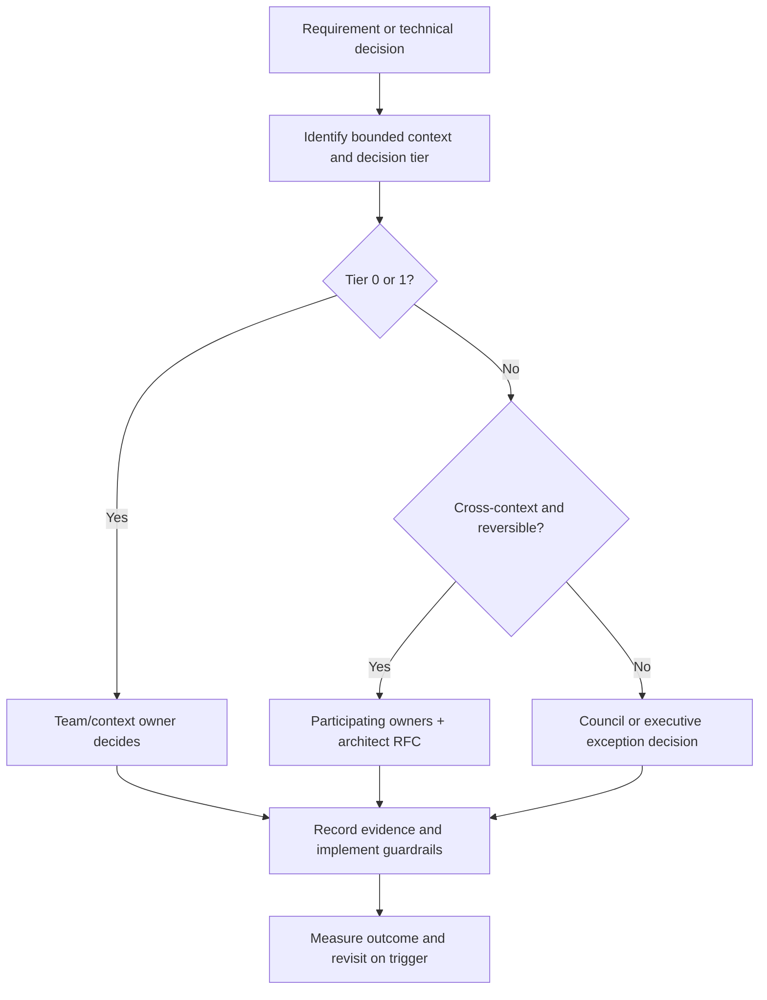

# Architecture Leadership and Operating Model

## Operating-model objective

Move architecture knowledge and decision authority from individuals into explicit domain ownership,
published standards, executable guardrails, and measurable outcomes.

The model must reduce executive-required technical decisions without creating a central architecture
team that approves routine delivery work.

## Organization design principles

- Align durable ownership to bounded contexts and platform products.
- A team may own multiple cohesive contexts; do not create a team per diagram box.
- Separate platform-enabling work from customer delivery, but build foundations with adopter teams.
- Keep decisions at the lowest level with sufficient context and accountability.
- Escalate based on blast radius, irreversibility, and cross-context impact.
- Encode repeated decisions in templates, tests, policies, and scorecards.
- Fund shared capabilities persistently; do not treat them as temporary transformation projects.

## Initial logical team topology

The actual reporting structure depends on current headcount. These are ownership groups, not a
recommendation to reorganize immediately.

| Logical team | Primary ownership | Interaction mode |
|---|---|---|
| Regulatory Experience | Regulatory Product, Application Intake, Party integration | Stream-aligned; consumes platform capabilities |
| Adjudication | Regulatory Case, Regulatory Review, Inspection, Regulatory Notice | Stream-aligned; collaborates on process contracts |
| Process and Credential | Configurable Regulatory Process, Credential Lifecycle, renewal journeys | Stream-aligned; orchestrates public context capabilities |
| Financial and Integration | Fees/Receivables and high-value external adapters | Stream-aligned or enabling depending on product line |
| Platform Enablement | Forms, Rules execution, Workflow Runtime, IAM integration, Documents, Communications, eventing, golden paths, CI/CD, observability, IDP | Platform-as-a-product |
| Data and Reporting Enablement | Event-fed projections, statutory reporting infrastructure, data governance | Enabling/platform |

With limited capacity, combine adjacent ownership groups but retain named context owners and contract
boundaries. Do not create shared ownership where nobody is accountable.

## Ownership roles

| Role | Accountability |
|---|---|
| Product capability owner | Customer and business outcomes, adoption, roadmap, investment priority |
| Bounded-context owner | Ubiquitous language, model integrity, invariants, APIs/events, lifecycle |
| Platform product owner | Developer/customer-team outcomes, adoption, reliability, support model |
| Platform architect | Context map, cross-context coherence, standards, trade-offs, facilitation |
| Engineering lead | Delivery quality, team capability, operational ownership |
| Security/privacy lead | Threat, privacy, data classification, regulatory controls |
| SRE/operations lead | SLOs, resilience, incident readiness, operability |
| Customer solution lead | Customer requirements, fit-gap evidence, configuration and migration plan |
| Domain expert | Regulatory meaning, policy intent, terminology, acceptance |
| Executive exception sponsor | Economic and operational accountability for custom exceptions |

Architecture is a distributed responsibility. The Platform Architect owns coherence and decision
quality, not every technical decision.

## Decision tiers

| Tier | Examples | Decision authority | Artifact |
|---|---|---|---|
| 0 - Local and reversible | Internal refactor, test structure, implementation detail | Delivery team | Code review and tests |
| 1 - Bounded-context | Aggregate boundary, domain policy, persistence model, context-owned API addition | Context owner | ADR when non-trivial |
| 2 - Cross-context/platform | Public contract, event, new extension point, platform standard, shared primitive | Participating owners plus platform architect | ADR/RFC and compatibility plan |
| 3 - Portfolio/irreversible | New bounded context, major breaking change, custom exception, data-boundary change, major technology introduction | Architecture council or executive sponsor | Decision record, economics, risk, migration |

Reversibility determines ceremony. A low-cost experiment should not require the same governance as a
customer data migration or public contract break.

## Architecture council

### Purpose

- approve or resolve Tier 3 decisions;
- resolve cross-context ownership disputes;
- maintain architecture principles and standards;
- review exception economics and expiry;
- monitor portfolio convergence and systemic risk;
- sponsor capability and skill investments.

### Membership

- Platform Architect as facilitator
- Relevant context owners
- Product leadership
- Security/privacy
- SRE/operations
- Data architecture when applicable
- Customer delivery representation
- Executive participation only for portfolio trade-offs and exceptions requiring sponsorship

### Guardrails

- No slide presentation for routine Tier 0/1 changes.
- Written decision material is circulated before the meeting.
- Decisions, owner, rationale, consequences, and revisit trigger are recorded.
- Council decisions have a service-level objective for turnaround.
- Repeated questions become standards, templates, or delegated policies.

## Decision workflow



## RACI for critical decisions

Legend: `A` accountable, `R` responsible, `C` consulted, `I` informed.

| Decision | Product | Context owner | Platform architect | Platform team | Security/SRE | Executive |
|---|---|---|---|---|---|---|
| Capability roadmap | A/R | C | C | I | I | I |
| Domain model and invariants | C | A/R | C | I | C | I |
| Cross-context contract | C | A/R | R | C | C | I |
| Golden-path standard | C | C | A | R | C | I |
| Configuration publication | A | R | I | C | C | I |
| New extension point | C | A/R | R | C | C | I |
| External integration | C | A/R | C | C | C | I |
| SLO and operational readiness | C | A | C | R | R | I |
| Custom exception | C | C | R | I | C | A |
| Platform investment/capacity | R | C | C | C | C | A |

Where multiple contexts participate, one provider context remains accountable for the contract.

## Executive-escalation reduction

Executive escalation usually indicates missing ownership, undocumented constraints, or unclear risk
authority. Address it through:

1. Publish the domain landscape, context ownership, and decision tiers.
2. Convert recurring executive decisions into principles and standards.
3. Capture rationale and revisit triggers in ADRs.
4. Establish named context and platform owners with delegated authority.
5. Maintain capability and component catalogs.
6. Make exceptions economic decisions with sponsors and expiry.
7. Use architecture office hours for coaching before escalation.
8. Track decision latency and executive-escalation rate.

Target:

```text
ExecutiveRequiredDecisionRate =
  technical decisions requiring executive intervention
  / non-routine technical decisions
```

The target is a declining trend, not zero. Executives should remain involved in strategic product
and commercial trade-offs, not routine API, schema, or implementation decisions.

## Architecture artifacts

| Artifact | Owner | Update trigger |
|---|---|---|
| Domain landscape and context map | Platform architect and context owners | Boundary or relationship change |
| Context charter | Context owner | Language, responsibility, or ownership change |
| ADR | Decision owner | Non-trivial decision |
| API/event contract | Provider context | Contract release |
| Standard and golden path | Platform Enablement | Repeated cross-team need |
| Exception register | Platform architect/governance owner | Exception status change |
| Capability roadmap | Product capability owner | Quarterly or material reprioritization |
| SLO/runbook | Operational owner | Reliability or operating-model change |
| Scorecard | Automated platform | Every build/deployment |

Documentation is stored with the owned artifact where possible and surfaced through the catalog.

## Governance cadence

| Cadence | Forum | Purpose |
|---|---|---|
| Continuous | CI/CD policy and scorecards | Enforce repeatable standards |
| Weekly | Architecture office hours | Unblock teams and shape early decisions |
| Fortnightly | Cross-context design review | Resolve Tier 2 RFCs |
| Monthly | Architecture council | Tier 3 decisions, exceptions, systemic risks |
| Monthly | Platform product review | Adoption, developer friction, reliability, roadmap |
| Quarterly | Portfolio convergence review | Outcomes, capacity, capability sequencing, retirement |
| Semiannual | Customer/domain advisory workshop | Validate variability mechanisms and roadmap |

Meetings are not the control system. Executable policies, ownership, and published artifacts are.

## Stakeholder engagement

### Product and customer delivery

- Introduce classification during opportunity and requirement discovery.
- Show whether a request is core, configuration, extension, integration, or exception before
  contractual commitment.
- Include platform fit, migration, and carrying cost in commercial estimates.
- Use representative customers as design partners, not as sole model owners.

### Engineering

- Pair context owners with platform enablement on the first golden paths.
- Run event-storming and context-mapping workshops around real product slices.
- Publish examples and reference implementations.
- Use office hours and communities of practice to spread decision capability.

### Operations and support

- Include support in observability and runbook design.
- Feed incident and ticket classification into the capability roadmap.
- Give support one correlation-based view of customer journeys.
- Include retirement and migration status in operational tooling.

### Executives

- Review outcomes and economics rather than implementation detail.
- Make capacity and exception trade-offs explicit.
- Hold owners accountable for adoption, reliability, and retirement.

## Platform-as-product backlog

Prioritize platform work using:

```text
PlatformPriority =
  frequency of developer/customer need
  x delay/support cost
  x risk reduction
  x number of consuming teams
  / implementation and operating cost
```

The formula structures discussion; it is not a substitute for judgment.

Platform discovery measures:

- time to create and productionize a new module or adapter;
- developer wait time for environments, access, and reviews;
- repeated support requests;
- pipeline failure causes;
- manual release and configuration steps;
- golden-path adoption and abandonment;
- consuming-team satisfaction and qualitative friction.

## Architecture leadership behaviors

The Platform Architect should:

- frame decisions in domain and economic terms;
- expose assumptions and reversible versus irreversible choices;
- facilitate domain discovery rather than dictate models;
- maintain context integrity and challenge boundary leaks;
- make standards executable and self-service;
- coach context owners and delegate decisions;
- use production and portfolio evidence to revisit architecture;
- communicate trade-offs to executives and customers;
- refuse unfunded targets or invisible exception costs.

## Operating-model success measures

| Measure | Desired direction |
|---|---|
| Executive-required decision rate | Down |
| Architecture decision lead time | Down without increased rework |
| Tier 0/1 decisions handled by teams | Up |
| Cross-context contract defects | Down |
| Golden-path adoption | Up |
| Active/expired custom exceptions | Down |
| Platform developer wait time | Down |
| Shared capability adoption | Up |
| Ownership coverage | Toward complete coverage |
| Decision reversals caused by missing stakeholders | Down |

